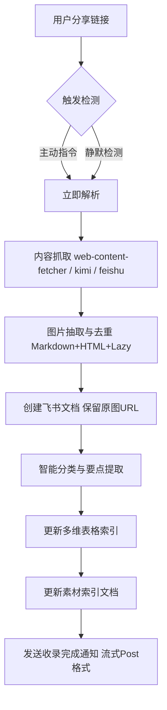

# OpenClaw - 智能内容自动化归集系统


## 🚀 项目简介

**OpenClaw** 是一个基于 AI 驱动的自动化内容收集与知识管理系统。它能够自动识别、抓取并收录社交平台（如微信公众号）、飞书文档及各类网页内容，并将其实时转化为结构化的飞书知识库文档。

核心愿景：**让有价值的信息零成本沉淀，让知识库随看随存。**

---

## ✨ 核心特性

- **多模式触发**：支持"显式指令"主动收录与群聊场景下的"静默收录"。
- **深度内容解析**：自动剥离网页杂质，精准提取标题、正文及核心摘要。
- **飞书生态联动**：一键生成飞书 Docx 文档，并同步更新多维表格（Bitable）索引。
- **智能分类体系**：基于 LLM 的内容理解，自动判定 8 大分类（技术教程、实战案例、产品文档、学习笔记、热点资讯、设计技能、工具推荐、训练营）。
- **图片自动化托管**：支持 Markdown / HTML / 懒加载 / srcset 等多源图片提取，自动上传飞书素材库，原文 URL 保留兜底。
- **预检安全机制**：内置安装预检流程，确保 OAuth 授权与空间权限时刻就绪。
- **全局可用**：所有用户、所有群聊、私聊均可触发收录，无需管理员权限。
- **批量收录**：支持批量链接收录，统一输出结构化响应。
- **知识库索引联动**：收录后自动更新多维表格 + 素材索引文档 + 分类统计。
- **删除管理**：支持通过关键词搜索并删除已收录记录。

---

## 🛠️ 工作流引擎



---

## 📦 快速开始

### 1. 技能安装
将本仓库克隆至你的 Agent 工作目录，或直接引用 `content-collector/SKILL.md`。

### 2. 环境配置
在你的 `MEMORY.md` 中补充以下配置项：

```markdown
## Content Collector Config
- **Knowledge Base Table**: `[你的多维表格 App Token]`
- **Table URL**: https://my.feishu.cn/base/[app_token]
- **Default Table ID**: `[你的 Table ID]`
- **Knowledge Base Space ID**: `[你的知识库节点 ID]`
- **知识库存储节点 node_token**: `[node_token]`
- **Knowledge Base URL**: https://my.feishu.cn/wiki/[node_token]
- **Content Categories**: 技术教程, 实战案例, 产品文档, 学习笔记, 热点资讯, 设计技能, 工具推荐, 训练营
- **Global Access**: 所有用户可用，所有群聊可用
- **Image Fetch Mode**: `all` / `cover_only`（默认 `all`）
- **Image Max Count**: `20`（单篇文档最多处理图片数）
- **Image Max Size MB**: `10`（单图超过阈值则跳过）
- **Image Timeout Sec**: `20`（下载超时）
- **Image Allowed Types**: `jpg,png,gif,webp`
- **Image Fallback**: `keep_original_link=true`
```

### 3. 权限预检
首次运行前，技能会自动执行以下权限校验：

| 权限项 | 验证工具 | 目的 |
|-------|---------|------|
| OAuth 授权 | `feishu_oauth` | 获取操作飞书文档和表格的用户凭证 |
| 知识库写入权限 | `feishu_create_doc` | 确保能在指定 Space ID 下创建节点 |
| 多维表格编辑权限 | `feishu_bitable_app_table_record` | 确保能向指定 app_token 写入记录 |
| 图片上传权限 | `feishu_im_bot_upload` | 允许将本地图片同步至飞书素材库 |

### 4. 图片能力说明（v2）
- 同时抽取 Markdown 与 HTML 的图片引用（含懒加载属性 `data-src`、`data-original`、`srcset`）。
- `feishu_create_doc` 可直接处理 markdown 中的外部图片 URL，飞书服务器自动下载转 CDN。
- 微信公众号防盗链图片可通过 `feishu_doc_media` 在文档末尾追加。
- 单张图片失败不阻断收录，最终文档保留失败提示与原始来源链接。
- 每篇文档最多处理 20 张图片，单图上限 10MB，仅允许 jpg/png/gif/webp。

---

## 📖 使用指南

### 触发词
`收录` / `转存` / `保存` / `存档` / `存一下` / `归档` / `备份` / `收藏` / `存到知识库` / `加入知识库` / `转飞书`

### 支持的链接类型

| 类型 | 示例 | 抓取方式 |
|------|------|---------|
| 微信公众号文章 | `https://mp.weixin.qq.com/s/xxx` | web-content-fetcher / kimi_fetch |
| 飞书文档 | `https://xxx.feishu.cn/docx/xxx` | feishu_fetch_doc |
| 飞书 Wiki | `https://xxx.feishu.cn/wiki/xxx` | feishu_fetch_doc |
| 通用网页 | General URLs | kimi_fetch / web_fetch |

### 主动模式
用户：*"存一下这个链接：https://mp.weixin.qq.com/s/..."*
Agent：*"✅ 收录完成。📄 📖 标题 | 日期"*

### 静默模式
在已配置的群聊中，直接粘贴链接，系统将自动进行后台收录并发送简洁通知。

### 删除记录
用户回复 `删除` 或 `删除 [关键词]`，系统通过关键词检索并确认后删除对应记录。

---

## 📊 智能分类体系

| 分类 | Emoji | 判断依据 | 示例 |
|------|-------|---------|------|
| 技术教程 | 📖 | 安装/配置/部署/教程 | API 用法、安装指南 |
| 实战案例 | 🛠️ | 案例/实战/项目/演示 | 项目 Demo、案例分析 |
| 产品文档 | 📄 | 安全/公告/版本/功能 | 发版说明、安全公告 |
| 学习笔记 | 💡 | 学习/成长/指南/笔记 | 最佳实践、架构指南 |
| 热点资讯 | 🔥 | 发布/新功能/热点 | GPT-5.4 发布解读 |
| 设计技能 | 🎨 | 设计/Prompt/美学 | Prompt 技巧、设计指南 |
| 工具推荐 | 🔧 | 工具/CLI/插件 | CLI 工具、插件推荐 |
| 训练营 | 🎓 | 训练营/课程/教学 | OpenClaw 训练营 |

**分类优先级**：用户指定 → 标题关键词 → 内容特征自动判断 → 不确定时标记"待分类"

---

## 📝 文档命名规范

```
[Emoji前缀] [原标题] | 收录日期

示例：
📖 OpenClaw保姆级教程 | 2026-03-08
🛠️ 火山方舟自动化报表案例 | 2026-03-08
🔥 GPT-5.4发布解读 | 2026-03-08
```

---

## ✅ 收录完成检查清单

每次收录必须完成以下所有步骤：

- [ ] 执行权限预检（验证 OAuth 及 Space/Table 写入权限）
- [ ] 获取并处理原始内容（含图片）
- [ ] 抽取并去重图片引用（Markdown + HTML）
- [ ] 图片托管到飞书（记录总数、成功数、失败数）
- [ ] 智能分类并确定 Emoji 前缀
- [ ] 提取核心要点（3-5 条）
- [ ] 生成关键词
- [ ] **创建飞书文档**（使用标准模板，指定 wiki_node）
- [ ] **更新多维表格**（添加完整记录，包含原链接/图片统计字段）
- [ ] **更新文档索引**（在素材索引中添加条目）
- [ ] 发送收录完成通知给用户

**任何一步未完成，视为收录失败！**

---

## 🔧 错误处理

| 错误 | 原因 | 解决方案 |
|------|------|---------|
| Fetch timeout | 网络问题或内容过大 | 重试或切换抓取方式 |
| Unauthenticated | OAuth 过期 | 触发 `feishu_oauth` 刷新凭证 |
| Permission denied | 无写入权限 | 检查飞书 Editor 角色 |
| Content too long | 超出 API 限制 | 截断或拆分文档 |
| Image download failed | 防盗链/超时 | 带 headers 重试，保留原始链接 |
| Image too large | 超出大小限制 | 压缩或跳过并记录 |

**恢复策略**：单步失败不阻断全流程，始终报告部分成功状态。

---

## 📂 项目结构

```text
openclaw/
└── content-collector/
    └── SKILL.md          # 核心技能逻辑定义（含完整工作流、模板、配置）
```

---

## 📜 许可证

本项目遵循 [MIT License](LICENSE) 协议。

---

> 此项目由 **Antigravity** 辅助设计与开发，致力于构建极致的 AI 自动化体验。
> 图片处理方案 v2.0 - 2026-03-17
